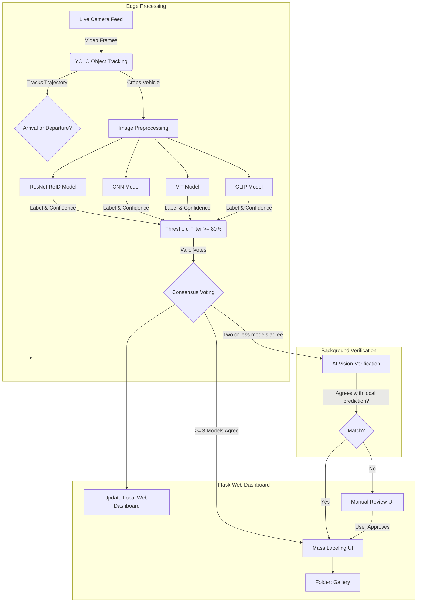
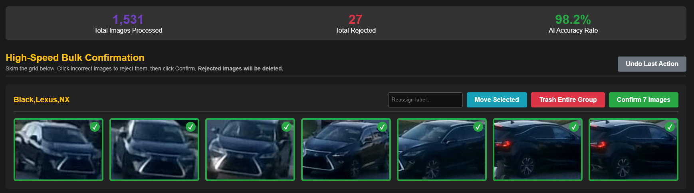
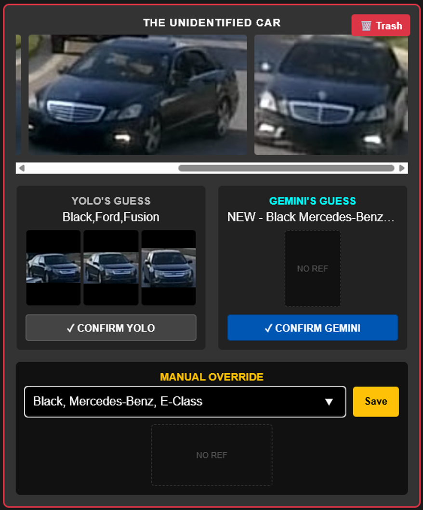
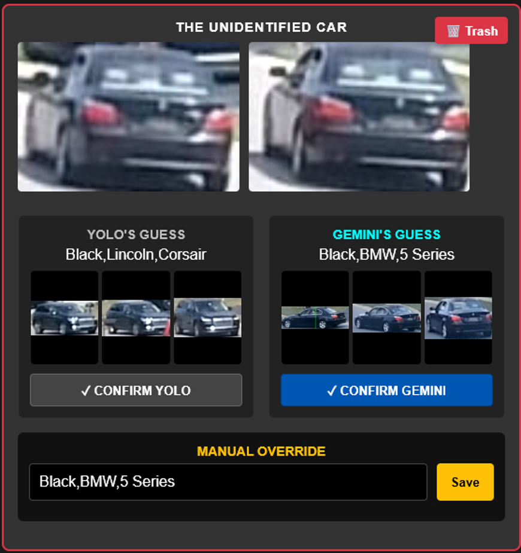

# CarReID
**Abstract:** CarReID is a local computer vision system that identifies, tracks, and logs neighborhood vehicles using a combination of object detection and classification models. The purpose is to provide awareness of vehicle movements within an area. It achieves this by combining YOLO-based tracking with a multi-task identification pipeline to accurately classify vehicle make, model, and color. The data is compiled and visualized on a secure, interactive local web dashboard.

<video src="https://github.com/Nuisey/CaReID/raw/master/Demo/Demo%20files/CarReID_20sec_Demo.mp4" controls="controls" width="100%"></video>

---
# Motivation

CarReID solves the problem for needing an cheap, automated, reliable monitoring of vehicle traffic in a localized area (such as residential neighborhoods or restricted facilities) without relying on privacy-invasive cloud surveillance services. While traditional camera systems require constant human monitoring and lack automated categorization. 

This project addresses the research question of how to efficiently combine multiple vision architectures to achieve robust vehicle re-identification and state tracking (e.g., mapping vehicles to specific homes) across varying environmental conditions.

On a personal level, this project gave me the opportunity to overcome a few challenges.

1. Research how the best vision models operate, are implemented, and finetuned.

2.  How to efficiently collect & label large amounts of messy, poor quality, real-world data.

3. How to organize this data into a working system to automate decision-making. 

---

# Visual Architecture

---

# Method and Results

## Detection & Tracking:
A pre-trained YOLO model detects and tracks vehicles in real-time from a live camera feed. It extracts a burst of cropped images of the vehicle that passes and by analyzing their vertical coordinate trajectories, the system determines arrival or departure status.
 

## Classification
**Ensemble Inference:** The images are passed into four different models, using different strategies to offset error. The ensemble consisting of:
- **Siamese ReID** - Specialized in fine-grained vehicle matching and tracking.
- **Custom CNN:** Extracts strong, localized texture and spatial features.
- **Vision Transformer (ViT):** Captures global context and structural patterns using self-attention.
- **OpenAI CLIP:** Provides foundational semantic understanding via vision-language embeddings.

 **Consensus Voting:** Instead of soft averaging confidence values, the system employs a hard-voting consensus mechanism. Each model casts a vote for a specific vehicle identity if its confidence exceeds an 80% threshold.
 

## Labeling
Labeling mass amounts of data was the most challenging part of this project. In order to make the process more efficient, I implemented:
 
 **Intelligent Routing**
  Based on the consensus, the system routes the images to different confidence tiers:
 - **>= 3 votes:** High confidence (sent to `Bulk Labeling` for immediate logging).
 - **Exactly 2 votes:** Medium confidence (sent to `AI Vision Verification`).
 - **< 2 votes:** Low confidence or completely new vehicle (flagged as `Unseen Car`).
 

 **Bulk Labeling**
 Easily confirm/deny hundreds of images a minute
 
 

**AI Vision Verification:** A background worker utilizes the Gemini 3.5-flash Vision API to analyze bursts of images for vehicles that got `Exactly 2 votes`. If the LLM's analysis agrees with the local models' prediction, the track is automatically synced and confirmed.

  
  

---
## Model Training Strategies
Because of the low-quality input data, standard classification techniques plateaued early. To overcome this, I iteratively trained and evaluated multiple architectures and loss functions:

1. **Convolutional Neural Networks (CNN):** 
   - **Strategy:** I started with standard classification on an EfficientNet-B0, but validation accuracy hovered around 24-65% even with unfreezing layers and data augmentations. I pivoted to treating the task as a Re-Identification (ReID) problem by applying the **ArcFace loss function** (which maximizes intra-class similarity and inter-class discrepancy), resulting in robust feature separation.
   
2. **CLIP (Contrastive Language-Image Pre-Training):**
   - **Strategy:** Initial linear probing on frozen features gave a decent baseline of 61%. To push performance further, I fine-tuned the last 6 layers of the vision encoder and integrated the ArcFace loss, which successfully adapted CLIP's generalized embeddings to my specific low-res vehicle domain.

3. **Vision Transformers (ViT):**
   - **Strategy:** Initial attempts using Parameter-Efficient Fine-Tuning (PEFT) with LoRA at a low rank (r=16) struggled to learn (19% accuracy). Success was achieved by increasing the LoRA rank/alpha (r=64) and coupling it with the ArcFace loss function.

**Key Takeaway:** The major breakthrough across all architectures was the introduction of the **ArcFace loss function**. Enforcing a distinct angular margin between classes allowed all models to overcome the 130x80 pixel resolution limit and converge at highly accurate validation scores.

## Challenges

**Low-Quality Real-World Data**
The most significant hurdle in this project was dealing with the reality of edge-device footage: messy, low-resolution data. The average image extracted by YOLO and fed into the classification pipeline has a resolution of roughly **130x80 pixels**. At this quality, it is physically impossible to discern license plates, manufacturer badges, or distinct trim text. Compounding this issue are the wildly varying lighting and weather conditions. This constraint forced the models to learn solely from the car's macroscopic features (shape, headlight placement, grill proportions), and challenged me to experiment with advanced training strategies to build a robust ensemble.

## Security and Ethics

Data privacy is the cornerstone of this neighborhood tracking system. Because the project monitors community vehicle movements, several strict ethical and security measures dictate its design:

1. **Edge Computing:** All video processing, object detection, and model inference (YOLO, CNN, ViT, CLIP) are performed entirely on the local device. No raw video feeds or images are ever uploaded to the cloud or third-party servers.
2. **Absence of PII Targeting:** The models are trained specifically to identify broad vehicle profiles rather than personally identifiable information. The system is not designed to read license plates or run facial recognition on drivers.
3. **Local Access Control:** The interactive dashboard is hosted locally via Flask (`localhost`). This ensures that the traffic data remains isolated to the local network and is only accessible to authorized residents, preventing external monitoring or data scraping.

