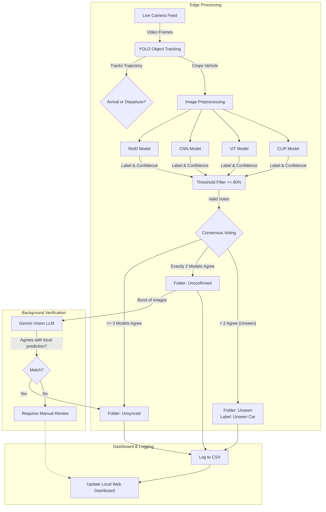

**Abstract:** CarReID is a local computer vision system that identifies, tracks, and logs neighborhood vehicles using a combination of object detection and classification models. The purpose is to provide awareness of vehicle movements within an area. It achieves this by combining YOLO-based tracking with a multi-task identification pipeline to accurately classify vehicle make, model, and color. The data is compiled and visualized on a secure, interactive local web dashboard.

---
# Motivation

This project solves the problem for needing an cheap, automated, reliable monitoring of vehicle traffic in a localized area (such as residential neighborhoods or restricted facilities) without relying on privacy-invasive cloud surveillance services. While traditional camera systems require constant human monitoring and lack automated categorization. 

This project addresses the research question of how to efficiently combine multiple vision architectures to achieve robust vehicle re-identification and state tracking (e.g., mapping vehicles to specific homes) across varying environmental conditions.

On a personal level, this project gave me the opportunity to overcome a few challenges.

1. Research how the best vision models operate, are implemented, and finetuned.

2.  How to efficiently collect & label large amounts of messy, poor quality, real-world data.

3. How to organize this data into a working system to automate decision-making. 

---
# Method and Results

### Detection & Tracking:
A YOLO model detects and tracks vehicles in real-time from a live camera feed. By analyzing their vertical coordinate trajectories, the system determines arrival or departure status and extracts a burst of cropped images of the vehicles.

### Classification
**Ensemble Inference:** The cropped images are passed into a four-model ensemble consisting of:
- A custom Siamese ReID (Re-Identification) model
- A custom Convolutional Neural Network (CNN)
- A Vision Transformer (ViT)
- A pre-trained CLIP model with a linear probe

 **Consensus Voting:** Instead of soft averaging confidence values, the system employs a hard-voting consensus mechanism. Each model casts a vote for a specific vehicle identity if its confidence exceeds an 80% threshold.

### Labeling
 **Intelligent Routing:** Based on the consensus, the system routes the images to different confidence tiers:
 - **>= 3 votes:** High confidence (sent to `Unsynced` for immediate logging).
 - **Exactly 2 votes:** Medium confidence (sent to `Unconfirmed`).
 - **< 2 votes:** Low confidence or completely new vehicle (flagged as `Unseen Car`).

**LLM Verification:** A background worker utilizes the Gemini 3.5-flash Vision API to analyze bursts of images for vehicles placed in the `Unconfirmed` tier. If the LLM's analysis agrees with the local models' prediction, the track is automatically synced and confirmed.

---
# Visual Architecture

---
# Security and Ethics

Data privacy is the cornerstone of this neighborhood tracking system. Because the project monitors community vehicle movements, several strict ethical and security measures dictate its design:

1. **Edge Computing:** All video processing, object detection, and model inference (YOLO, CNN, ViT, CLIP) are performed entirely on the local device. No raw video feeds or images are ever uploaded to the cloud or third-party servers.
2. **Absence of PII Targeting:** The models are trained specifically to identify broad vehicle profiles rather than personally identifiable information. The system is not designed to read license plates or run facial recognition on drivers.
3. **Local Access Control:** The interactive dashboard is hosted locally via Flask (`localhost`). This ensures that the traffic data remains isolated to the local network and is only accessible to authorized residents, preventing external monitoring or data scraping.

# Challenges
 The biggest thing was dealing with poor quality, messy, real-world data. The average image being fed into the classification models had a resolution of 130x80 pixels. At this quality, you cannot discern the license plate, make or model badges. Pictures are taken at all different light levels and weather conditions. This pushed the models to learn solely on the car's features, which, in turn, challenged me to build a collection of robust models. 
 