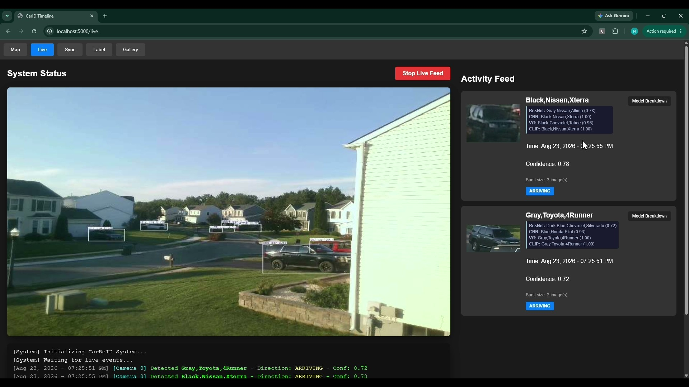

# CarReID
(Warning: the README is still a work in process. Due to deadlines, certain sections are not elaborated on enough or in need of polishing. I am expecting to have a finished version by 8/26)

**Abstract:** CarReID is a local computer vision system that identifies, tracks, and logs neighborhood vehicles using a combination of object detection and classification models. The purpose is to provide awareness of vehicle movements within an area. It achieves this by combining YOLO-based tracking with a multi-task identification pipeline to accurately classify vehicle make, model, and color. The data is compiled and visualized on a secure, interactive local web dashboard.

<i>Click photo to play 30 second demo</i>

---
# Motivation

CarReID solves the problem for needing an cheap, automated, reliable monitoring of vehicle traffic in a localized area (such as residential neighborhoods or restricted facilities) without relying on privacy-invasive cloud surveillance services. While traditional camera systems require constant human monitoring and lack automated categorization. 

This project addresses the research question of how to efficiently combine multiple vision architectures to achieve robust vehicle re-identification and state tracking (e.g., mapping vehicles to specific homes) across varying environmental conditions.

On a personal level, this project gave me the opportunity to overcome a few challenges.

1. Research how the best vision models operate, are implemented, and finetuned.

2.  How to efficiently collect & label large amounts of messy, poor quality, real-world data.

3. How to organize this data into a working system to automate decision-making. 

---

# Visual Architecture

---

# Methods

## Detection & Tracking:
A pre-trained YOLO model detects and tracks vehicles in real-time from a live camera feed. It extracts a burst of cropped images of the vehicle that passes and by analyzing their vertical coordinate trajectories, the system determines arrival or departure status.
 

## Classification
**Multi-Architecture Inference:** The images are passed into four different models, using different strategies to offset error. The ensemble consisting of:
- **Embedding CNN (ResNet-IBN)** 
- **Classification CNN (EfficientNet-B0)** 
- **Standard Vision Transformer (ViT)** 
- **Semantic-Vision Transformer (OpenAI CLIP)** 

 **Consensus Voting:** Instead of soft averaging confidence values, the system employs a hard-voting consensus mechanism. Each model casts a vote for a specific vehicle identity if its confidence exceeds an 80% threshold.
 

## Labeling
Labeling mass amounts of data was the most challenging part of this project. In order to get a baseline dataset for the models, I had to label 3,000 images manually. To make the process more efficient, I implemented:
 
 **Intelligent Routing**
  Based on the consensus, the system routes the images to different confidence tiers:
 - **>= 3 votes:** High confidence (sent to `Bulk Labeling` for immediate logging).
 - **Exactly 2 votes:** Medium confidence (sent to `AI Vision Verification`).
 - **< 2 votes:** Low confidence or completely new vehicle flagged as `Unseen Car` (sent to `AI Vision Verification`).
 

**AI Vision Verification:** A background worker utilizes the Gemini 3.5-flash Vision API to analyze bursts of images for vehicles that got 2 or less votes. If the LLM's analysis agrees with the local models' prediction, the track is automatically synced and confirmed.

  
  

 

 **Bulk Labeling**
 Easily confirm/deny hundreds of images a minute
 

---
## Model Training Strategies

1. **Embedding CNN**
   - **Source:** This was the starting model, adapted from the `regob/vehicle_reid` repository (which is built upon a popular Person Re-Identification framework).
   - **Architecture:** This model utilizes a **ResNet50-IBN** backbone. IBN is an architectural tweak that combines Instance Normalization and Batch Normalization. This makes the model focus on the shape of the object instead of the noise (like lighting or weather). Instead of a classification head, it preform a Distance-Based search to other example photos (within the gallery). When the system begins, it takes an embedding vector for every photo in the gallery. When an unknown car appears, it extracts an embedding vector and using Cosine Similarity, compares it to all the examples in the gallery. The closest vector to the target's is chosen, with however similar being the confidence score.
   - **Training & Fine-Tuning:** The model was fine-tuned on the custom neighborhood dataset using standard Cross-Entropy (ID) loss over 40 epochs. It also involved Random Erasing, which erased square blocks at random, which forced the model to pay attention to the whole car instead of just memorizing certain features like the headlights.

2. **EfficientNet-B0**
   - **Source:** Standard PyTorch/timm `EfficientNet-B0` architecture.
   - **Architecture:** EfficientNet utilizes compound scaling and inverted bottleneck blocks (MBConv) to extract highly efficient, localized texture and spatial features (like wheel rims, grill meshes, and headlight shapes).
   - **Training & Fine-Tuning:** Initial attempts at standard classification plateaued early (35-65% accuracy) due to the severe 130x80 pixel resolution data. The breakthrough occurred by treating it as a Re-Identification (ReID) problem via ArcFace loss function. ArcFace enforces a strict angular margin between classes in the latent space, maximizing intra-class similarity (same car looks similar) and inter-class discrepancy (pushing different cars further apart), resulting in highly accurate convergence.

3. **Vision Transformer (ViT)**
   - **Source:** A foundational Google Vision Transformer (`google/vit-base-patch16-224`) pulled from Hugging Face. 
   - **Architecture:** This model completely abandons standard convolutional layers. Instead, it slices the image into a grid of 16x16 pixel patches, treats them as a sequence, and processes them through self-attention layers. This allows the model to look at the entire vehicle at once, capturing global context and structural layout rather than relying on localized textures.
   - **Training & Fine-Tuning:** Due to the heavy nature of Transformers, it was fine-tuned using Parameter-Efficient Fine-Tuning (PEFT) via LoRA (Low-Rank Adaptation)**. Initial attempts at a low rank (r=16) struggled to learn (19% accuracy). Successful convergence was achieved by dramatically increasing the LoRA rank/alpha (r=64) and coupling it with the ArcFace loss function, forcing the global attention patterns to distinctly separate vehicle identities.

4. **OpenAI CLIP**
   - **Source:** Developed by OpenAI (`openai/clip-vit-base-patch32`) and pulled from Hugging Face.
   - **Architecture:** Originally a dual-encoder model (Vision and Text) trained contrastively on hundreds of millions of image-text pairs across the internet. For this project, only the Vision Encoder (a patch-32 ViT) is utilized. Because of its text-aligned pre-training, its latent space is uniquely organized around human *semantic concepts* (e.g., "red", "sedan", "convertable") rather than pure pixel structures.
   - **Training & Fine-Tuning:** Initial integration started with a "Linear Probe" approach—freezing the heavy foundational weights to preserve its generalized multimodal intelligence and training a lightweight Multi-Layer Perceptron (MLP) head on top. To push performance further on the low-resolution domain, the last 6 layers of the vision encoder were unfrozen and fine-tuned alongside the ArcFace loss function, mapping broad semantic concepts to specific neighborhood vehicle IDs.

**Key Takeaway:** The major breakthrough across all architectures was the introduction of the **ArcFace loss function**. Enforcing a distinct angular margin between classes allowed all models to overcome the 130x80 pixel resolution limit and converge at highly accurate validation scores.

<i>Click photo to play full demo</i>

# Results

## Challenges

**Low-Quality Real-World Data**
The most significant hurdle in this project was dealing with the reality of edge-device footage: messy, low-resolution data. The average image extracted by YOLO and fed into the classification pipeline has a resolution of roughly **130x80 pixels**. At this quality, it is physically impossible to discern license plates, manufacturer badges, or distinct trim text. Compounding this issue are the wildly varying lighting and weather conditions. This constraint forced the models to learn solely from the car's macroscopic features (shape, headlight placement, grill proportions), and challenged me to experiment with advanced training strategies to build a robust ensemble.

## Security and Ethics

Data privacy is the cornerstone of this neighborhood tracking system. Because the project monitors community vehicle movements, several strict ethical and security measures dictate its design:

1. **Edge Computing:** All video processing, object detection, and model inference (YOLO, CNN, ViT, CLIP) are performed entirely on the local device. No raw video feeds or images are ever uploaded to the cloud or third-party servers.
2. **Absence of Personal Information:** The models are trained specifically to identify broad vehicle profiles rather than personally identifiable information. The system is not designed to read license plates or run facial recognition on drivers.
3. **Local Access Control:** The interactive dashboard is hosted locally via Flask (`localhost`). This ensures that the traffic data remains isolated to the local network and is only accessible to authorized residents, preventing external monitoring or data scraping.

