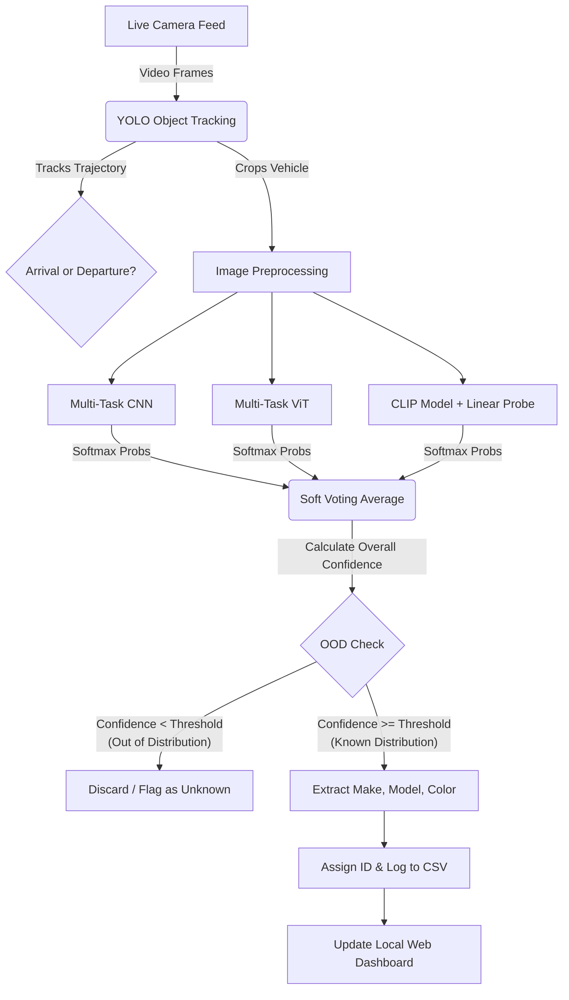

# Title and Abstract

**Title:** CarReID: Real-Time Multi-Modal Vehicle Tracking and Identification System

**Abstract:** CarReID is an edge-based computer vision system that automatically tracks, identifies, and logs neighborhood vehicles using an ensemble of deep learning models. The project's purpose is to provide real-time situational awareness of vehicle movements (arrivals and departures) within a localized area. It achieves this by combining YOLO-based tracking with a multi-task identification pipeline to accurately classify vehicle make, model, and color, presenting the data on a secure, interactive local web dashboard.

---

# Motivation

The primary problem being solved is the need for automated, reliable monitoring of vehicle traffic in localized environments (such as residential neighborhoods or restricted facilities) without relying on privacy-invasive cloud surveillance services. Traditional camera systems require constant human monitoring and lack automated categorization. This project addresses the research question of how to efficiently combine multiple vision architectures to achieve robust vehicle re-identification and state tracking (e.g., mapping vehicles to specific homes) across varying environmental conditions, all while strictly preserving community privacy.

---

# Method and Results

Our chosen method utilizes a two-stage pipeline. First, a YOLO model detects and tracks vehicles in real-time from a live camera feed. It analyzes their vertical coordinate trajectories to determine arrival or departure status and extracts cropped images of the vehicles. Second, the cropped images are passed into a multi-task ensemble model consisting of three distinct architectures: a custom CNN, a Vision Transformer (ViT), and a pre-trained CLIP model with a linear probe. These models simultaneously predict the vehicle's make, model, and color. The predictions are aggregated using soft voting to maximize accuracy. This ensemble approach significantly improves robustness over single-model architectures, providing high-confidence classifications that automatically update the local Flask web dashboard in real time.

---

# Visual Architecture

---

# Security and Ethics

Data privacy is the cornerstone of this neighborhood tracking system. Because the project monitors community vehicle movements, several strict ethical and security measures dictate its design:

1. **Edge Computing:** All video processing, object detection, and model inference (YOLO, CNN, ViT, CLIP) are performed entirely on the local device. No raw video feeds or images are ever uploaded to the cloud or third-party servers.
2. **Data Minimization:** The system focuses on extracting metadata (make, model, color, timestamps, and direction). Cropped images are only kept temporarily for identification and dashboard visualization, intentionally limiting the long-term storage of identifiable media.
3. **Absence of PII Targeting:** The models are trained specifically to identify broad vehicle profiles rather than Personally Identifiable Information (PII). The system is not designed to read license plates or run facial recognition on drivers.
4. **Local Access Control:** The interactive dashboard is hosted locally via Flask (`localhost`). This ensures that the traffic data remains isolated to the local network and is only accessible to authorized residents, preventing external monitoring or data scraping.
